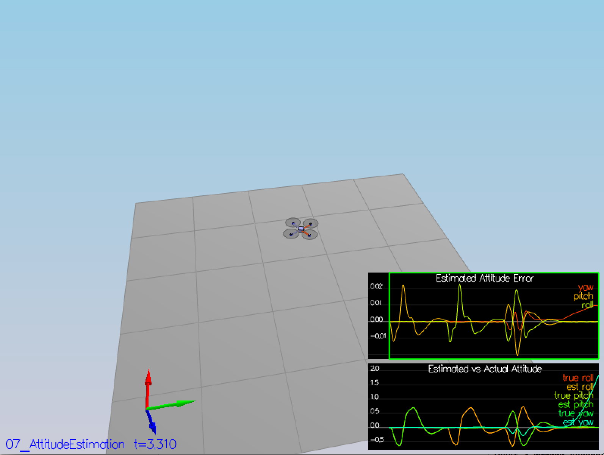
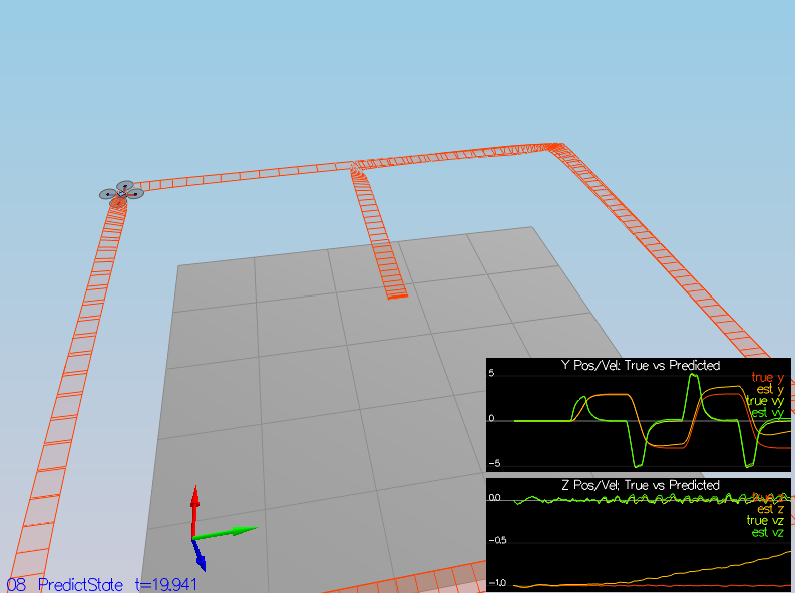
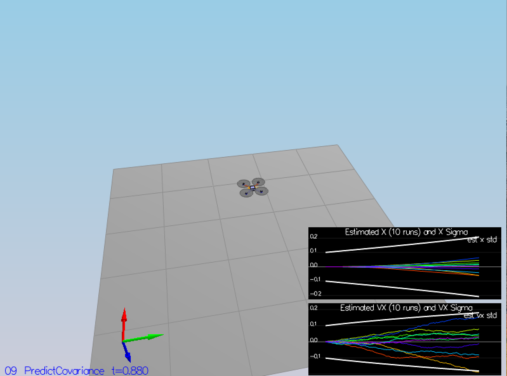
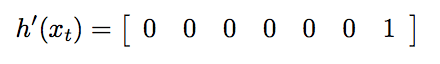
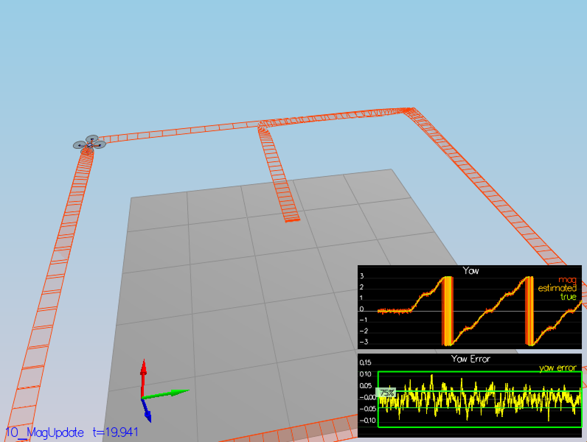
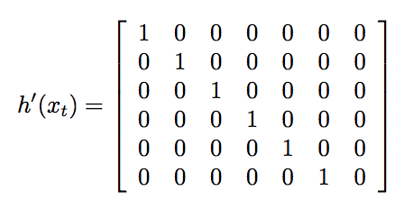
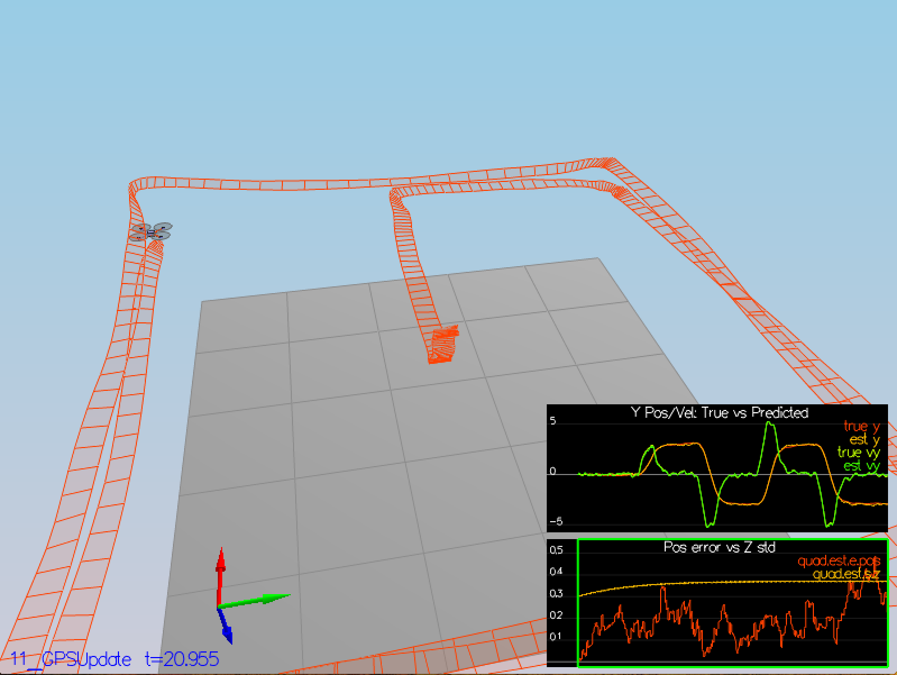

# Estimation Project #

This README is broken down into the following sections:

 - [Setup](#setup) - the environment and code setup required to get started and a brief overview of the project structure
 - [The Tasks](#the-tasks) - the tasks you will need to complete for the project
 - [Tips and Tricks](#tips-and-tricks) - some additional tips and tricks you may find useful along the way
 - [Submission](#submission) - overview of the requirements for your project submission

## The Tasks ##

 - [Step 1: Sensor Noise](#step-1-sensor-noise)
 - [Step 2: Attitude Estimation](#step-2-attitude-estimation)
 - [Step 3: Prediction Step](#step-3-prediction-step)
 - [Step 4: Magnetometer Update](#step-4-magnetometer-update)
 - [Step 5: Closed Loop + GPS Update](#step-5-closed-loop--gps-update)
 - [Step 6: Adding Your Controller](#step-6-adding-your-controller)

### Step 1: Sensor Noise ###

The standard deviation of sensors are computed with a python script, simply by reading in all data
into a list and applying `std()` function in numpy. GPS standard deviation is 0.7053.
Accelerometer standard deviation is 0.4895.

### Step 2: Attitude Estimation ###

Implemented in `UpdateFromIMU()`. Roll, pitch, yaw information is converted from global frame into
body frame. These values are integrated with measurements from gyro sensors. Roll, pitch, yaw values
after integration are converted back to global frame.

### Step 3: Prediction Step ###

Implemented in `PredictState()` and `Predict()`.

### Step 4: Magnetometer Update ###

Implemented in `UpdateFromMag()`. Yaw state is updated with information from magnetometer.
`hPrime` only has last entry as 1 since only yaw will be updated.

### Step 5: Closed Loop + GPS Update ###

Implemented in `UpdateFromGPS()`. State variables are updated with matrix `hPrime`.

### Step 6: Adding Your Controller

Controller is de-tuned to stablize scenario `11_GPSUpdate`.
